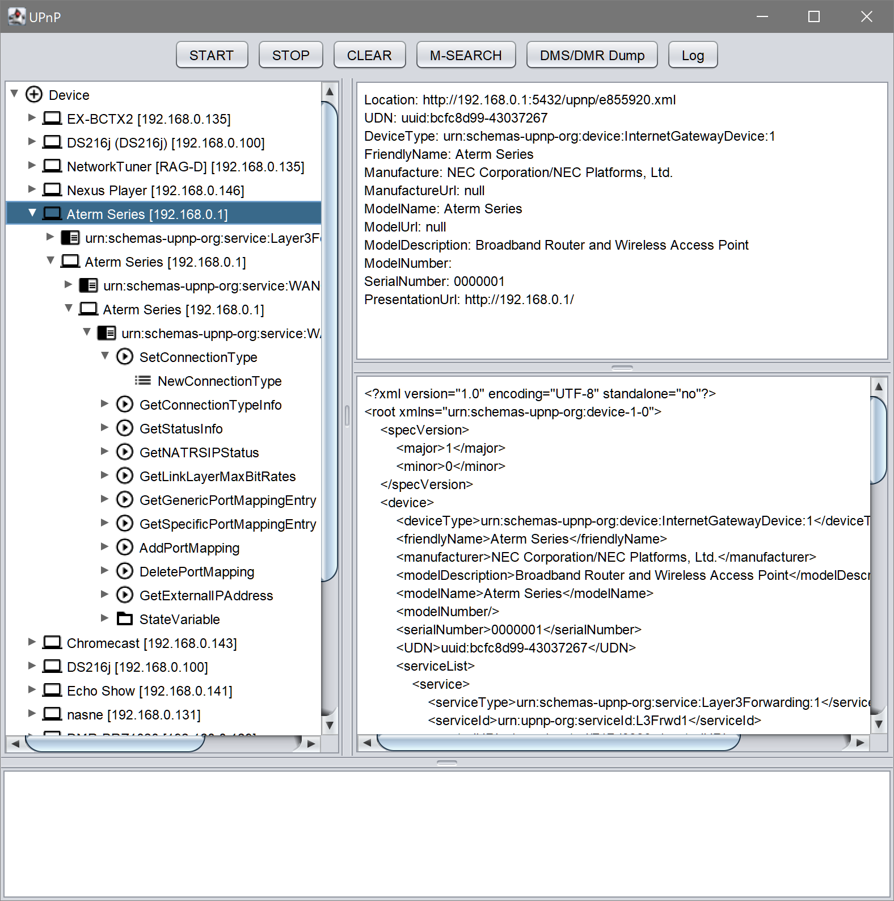
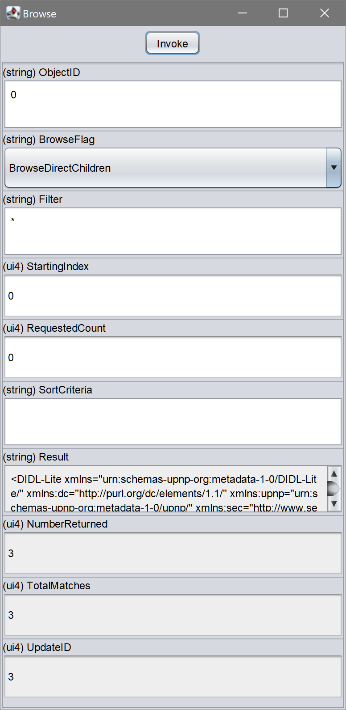

# mmupnp
[](./LICENSE)
[](https://github.com/ohmae/mmupnp/releases)
[](https://github.com/ohmae/mmupnp/issues)
[](https://github.com/ohmae/mmupnp/issues)
[](https://travis-ci.org/ohmae/mmupnp)
[](https://codecov.io/gh/ohmae/mmupnp)
[](https://bintray.com/ohmae/maven/net.mm2d.mmupnp)
[](https://bintray.com/ohmae/maven/net.mm2d.mmupnp)

Universal Plug and Play (UPnP) ControlPoint library for Java.

## Feature
- Pure Java implementation.
- Available in both Java application and Android apps.
- Easy to use
- High response

This can also be used from kotlin.

## Requirements
- kotlin 1.3 or later
- Java 6 or later

## Restrictions
- This library support only ControlPoint functions.
There is no way to make Device. If you need it, please select another library.
- Some functions that are not widely used are not implemented.
  - Multicast eventing

## Example of use
Android App
- DMS Explorer --
[[Google Play](https://play.google.com/store/apps/details?id=net.mm2d.dmsexplorer)]
[[Source Code](https://github.com/ohmae/DmsExplorer)]

Sample App

|||
|-|-|

## How to use

Download from jCenter.

```gradle
repositories {
    jcenter()
}
```

Add dependencies, such as the following.

```gradle
dependencies {
    implementation 'net.mm2d:mmupnp:2.0.0'
}
```

Some API are not compatible with 1.x.x

1.x.x support has been discontinued.
To access 1.x.x see [1.x.x branch](https://github.com/ohmae/mmupnp/tree/support/1.x.x)

This branch is developing 3.0.0.
To access 2.x.x see [2.x.x branch](https://github.com/ohmae/mmupnp/tree/support/2.x.x)

### Test release

This library is under development of 3.0.0.
There are no plans to make major changes to the specification, but it will be rewritten with Kotlin.
And undergoing destructive change.

Distributed in the following maven repository.

```gradle
repositories {
    maven {
        url 'https://ohmae.github.com/mmupnp/maven'
    }
}
dependencies {
    implementation 'net.mm2d:mmupnp:3.0.0-alpha1'
}
```

### Initialize and Start

```kotlin
val cp = ControlPointFactory.create().also {
    // adding listener if necessary.
    it.addDiscoveryListener(...)
    it.addNotifyEventListener(...)
    it.initialize()
    it.start()
}
...
```

To specify the network interface, describe the following.

```kotlin
val cp = ControlPointFactory.create(
    interfaces = listOf(NetworkInterface.getByName("eth0"))
)
```

By default ControlPoint will work with dual stack of IPv4 and IPv6.
To operate with IPv4 only, specify the protocol as follows.

```kotlin
val cp = ControlPointFactory.create(
    protocol = IP_V4_ONLY
)
```

You can change the callback thread.
For example in Android, you may want to run callbacks with MainThread.
In that case write as follows.

```kotlin
val cp = ControlPointFactory.create(
    callbackHandler = { handler.post(it) }
)
```

Or If use executor

```kotlin
val cp = ControlPointFactory.create(
    callbackExecutor = object : TaskExecutor{
        private val executor = Executors.newSingleThreadExecutor()
        override fun execute(task: Runnable): Boolean {
            executor.execute(task)
        }

        override fun terminate() {
            executor.shutdownNow()
        }
    }
)
```

### M-SEARCH
Call ControlPoint#search() or ControlPoint#search(String).

```kotlin
cp.search()                  // Default ST is ssdp:all
```

```kotlin
cp.search("upnp:rootdevice") // To use specific ST. In this case "upnp:rootdevice"
```

These methods send one M-SEARCH packet to all interfaces.

### Invoke Action
For example, to invoke "Browse" (ContentDirectory) action...

```kotlin
val mediaServer = cp.getDevice(UDN)           // get device by UDN
val browse = mediaServer.findAction("Browse") // find "Browse" action
browse?.invoke(
    mapOf(
        "ObjectID" to "0",
        "BrowseFlag" to "BrowseDirectChildren",
        "Filter" to "*",
        "StartingIndex" to "0",
        "RequestedCount" to "0",
        "SortCriteria" to ""
    ),
    onResult = {
        val resultXml = it.get("Result")// get result
        ...
    },
    onError = {
        // on error
        ...
    }
)
```

### Event Subscription
For example, to subscribe ContentDirectory's events...

```kotlin
// add listener to receive event
controlPoint.addNotifyEventListener(adapter { service, seq, variable, value ->
    eventArea.text = "${eventArea.text}${service.serviceType} : $seq : $variable : $value\n"
})
val mediaServer = cp.getDevice(UDN)          // get device by UDN
val cds = mediaServer.findServiceById(
  "urn:upnp-org:serviceId:ContentDirectory") // find Service by ID
cds.subscribe()                              // Start subscribe
...
cds.unsubscribe()                            // End subscribe
```

### Stop and Terminate

```kotlin
cp.stop()
cp.terminate()
```

It is not possible to re-initialize.
When you want to reset, try again from the constructor call.

### Debug log output

This library use [log library](https://github.com/ohmae/log),

If you want to enable debug log.

```kotlin
Logger.setLogLevel(Logger.VERBOSE)
Logger.setSender(Senders.create())
```

In this case output to `System.out`

To send log to a library,
eg. Simply change the output method.

```kotlin
Logger.setSender(DefaultSender.create({ level, tag, message ->
    message.split('\n').forEach {
        android.util.Log.println(level, tag, it)
    }
}))
```

eg. To handle exception

```kotlin
Logger.setSender { level, message, throwable -> 
    if (level >= Log.DEBUG) {
        SomeLogger.send(...)
    }
}
```

Please see [log library](https://github.com/ohmae/log) for more details

### Documents

I described Javadoc/KDoc comments. Please refer to it for more information.
- [Javadoc for 2.0.0](https://ohmae.github.io/mmupnp/javadoc/)
- [KDoc for 3.0.0](https://ohmae.github.io/mmupnp/dokka/)

## Author
大前 良介 (OHMAE Ryosuke)
http://www.mm2d.net/

## License
[MIT License](./LICENSE)
