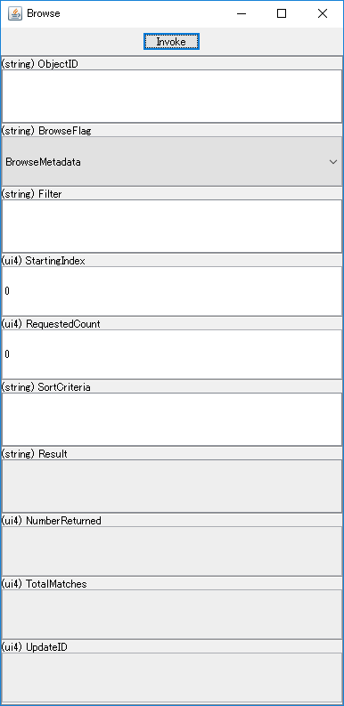

# mmupnp
[](./LICENSE)
[](https://github.com/ohmae/mmupnp/releases)
[](https://github.com/ohmae/mmupnp/issues)
[](https://github.com/ohmae/mmupnp/issues)
[](https://travis-ci.org/ohmae/mmupnp)
[](https://codecov.io/gh/ohmae/mmupnp)

Universal Plug and Play (UPnP) ControlPoint library for Java.

## Feature
- Pure Java implementation.
- Available in both Java application and Android apps
- Easy to use
- High response

## Requirements
- Java SE 7 or later
- Android API Level 15 (Android 4.0.3) or later

As you know, Android Studio (2.2 or later) supports Java 8 development.
But it is NOT fully support. Several statements depend on the API level.
For example, try-with-resource statement requires API level 19.
Therefore, this library restricts the use of such statement.

## Restrictions
- This library support only ControlPoint functions.
There is no way to make Device. If you need it, please select another library.
- Some functions that are not widely used are not implemented.
  - Multicast eventing
  - IPv6

## Example of use
Android App
- DMS Explorer --
[[Google Play](https://play.google.com/store/apps/details?id=net.mm2d.dmsexplorer)]
[[Source Code](https://github.com/ohmae/DmsExplorer)]

Sample App

|||
|-|-|

## How to use

I placed maven repository on gh-pages.
```groovy
repositories {
    maven {
        url 'https://ohmae.github.com/mmupnp/maven'
    }
}

dependencies {
    compile 'net.mm2d.mmupnp:mmupnp:1.2.3'
}
```

### Initialize and Start
```java
ControlPoint cp = new ControlPoint();
cp.initialize();
// adding listener if necessary.
cp.addDiscoveryListener(...);
cp.addNotifyEventListener(...);
cp.start();
...
```

If you want to specify the network interface, describe the following.
```
NetworkInterface ni = NetworkInterface.getByName("eth0");
ControlPoint cp = new ControlPoint(ni);
```

### M-SEARCH
Call ControlPoint#search() or ControlPoint#search(String).
```java
cp.search();                   // Default ST is ssdp:all
```
```
cp.search("upnp:rootdevice"); // To use specific ST. In this case "upnp:rootdevice"
```
These methods send one M-SEARCH packet to all interfaces.

### Invoke Action
For example, to invoke "Browse" (ContentDirectory) action...
```java
...
Device mediaServer = cp.getDevice(UDN);           // get device by UDN
Action browse = mediaServer.findAction("Browse"); // find "Browse" action
Map<String, String> arg = new HashMap<>();        // setup arguments
arg.put("ObjectID", "0");
arg.put("BrowseFlag", "BrowseDirectChildren");
arg.put("Filter", "*");
arg.put("StartingIndex", "0");
arg.put("RequestedCount", "0");
arg.put("SortCriteria", "");
Map<String, String> result = browse.invoke(arg);  // invoke action
String resultXml = result.get("Result");          // get result
...
```

### Event Subscription
For example, to subscribe ContentDirectory's events...
```java
...
// add listener to receive event
cp.addNotifyEventListener(new NotifyEventListener(){
  public void onNotifyEvent(Service service, long seq, String variable, String value) {
    ...
  }
});
Device mediaServer = cp.getDevice(UDN);          // get device by UDN
Service cds = mediaServer.findServiceById(
  "urn:upnp-org:serviceId:ContentDirectory");    // find Service by ID
cds.subscribe(); // Start subscribe
...
cds.unsubscribe(); // End subscribe
```

### Stop and Terminate
```java
...
cp.stop();
cp.removeDiscoveryListener(...);
cp.removeNotifyEventListener(...);
cp.terminate();
```
It is not possible to re-initialize.
When you want to reset, try again from the constructor call.

### Debug log output

This library contains [useful class for log output](./lib/src/main/java/net/mm2d/util/Log.java),
and it is used for error logs inside the library.
This log output class can also be used from the application.

By default, a log when an error occurs is output to `System.out`.
If you do not want to output log, describe the following at initialize.

```java
Log.setLogLevel(Log.ASSERT);
Log.setPrint(Log.EMPTY_PRINT);
```

If you use this library on Android, you will want to use `android.util.Log` instead of `System.out`.
Also, you will want to disable the output at release build.
The sample code for that case is following.

```java
if (BuildConfig.DEBUG) {
    Log.setAppendCaller(true);
    Log.setLogLevel(Log.VERBOSE);
    Log.setPrint((level, tag, message) -> {
        final String[] lines = message.split("\n");
        for (final String line : lines) {
            android.util.Log.println(level, tag, line);
        }
    });
    return;
}
Log.setLogLevel(Log.ASSERT);
Log.setPrint(Log.EMPTY_PRINT);
```

### Documents

I described Javadoc comments. Please refer to it for more information.
- Javadoc in Japanese
  - https://ohmae.github.io/mmupnp/javadoc/

## Author
大前 良介 (OHMAE Ryosuke)
http://www.mm2d.net/

## License
[MIT License](./LICENSE)
